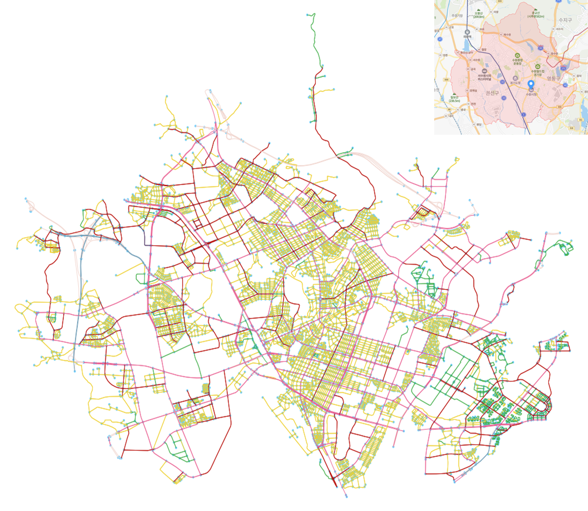

# Reproduction of Relational Fusion Network
This library contains a reproducted implementation of the Relational Fusion Network (RFN) 
introduced in the SIGSPATIAL'19 paper _Graph Convolutional Networks for Road Networks_ 
by Tobias Skovgaard Jepsen, Christian S. Jensen, and Thomas Dyhre Nielsen. 
Paper can be found in [here](https://arxiv.org/abs/1908.11567) 
and code can be found in [here](https://github.com/TobiasSkovgaardJepsen/relational-fusion-networks) .
Most of the code is from the original code.
Custom added codes are in custom folder.
Road network data for 12 Korean cities are in `data.zip`. 
First unzip it.
Pre-trained network parameter data is in `model_data` folder.
See `Train.ipynb` for training, `Test.ipynb` for testing.

You need to install osmnx, MXNet, dgl, PyTorch.
MXNet and dgl should be gpu-version.

## Explanation on dataset
### Input Attributes
For node attribute, in/out degree were used.
For edge attribute, road category, length were used.
For between-edge attribute, turning angle was used.
### Target Data (Driving Speed Data)
Original paper used historical speed data in single city and
split them into train/test data.
However, I could not obtain such date-by-date data.
Instead, I used osmnx default provided driving speed data.
However they gave speed values with limited types. 
(e.g. only 7 different values in Suwon)

If you can access more accurate speed data, 
it is recommended to use it instead.

## Result
MSE loss for test set cities are written down in below table.

|             | Daegu    | Suwon    | Ulsan    | Yongin   | average  |
|-------------|----------|----------|----------|----------|----------|
| RFN_Int_Att | 0.01380  | 0.00647  | 0.01754  | 0.00821  | 0.01150  |
| RFN_Int_Non | 0.01725  | 0.01252  | 0.01902  | 0.02812  | 0.01923  |
| RFN_Add_Att | 0.01598  | 0.01097  | 0.01968  | 0.02828  | 0.01873  |
| RFN_Add_Non | 0.01582  | 0.01013  | 0.01954  | 0.02983  | 0.01883  |
| GAT         | 0.04189  | 0.02764  | 0.03788  | 0.05231  | 0.03993  |
| GCN         | 0.04681  | 0.03600  | 0.04592  | 0.06588  | 0.04865  |
| GraphSAGE   | 0.04487  | 0.03236  | 0.03112  | 0.04475  | 0.03827  |
| MLP         | 0.02547  | 0.01225  | 0.02236  | 0.01405  | 0.01853  |

RFN gave better result than baseline algorithms. 
Especially RFN with intentional fusion and attentional aggregation 
gave the best result.
Although limited data was used, 
it was possible to verify the effectiveness of RFN 
over traditional graph convolution networks as the paper says.
